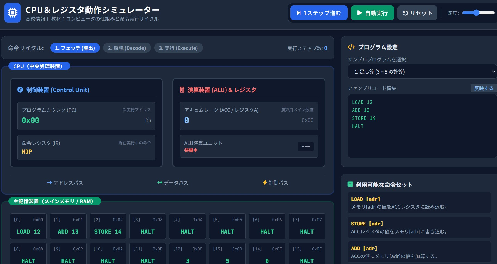

# 情報Ⅰサポートツール 技術編

## 高校「情報Ⅰ」の学習を支援するために作成した、インタラクティブ教材のポータルWebページです。

コンピュータの仕組み、論理回路、数値の内部表現、アルゴリズム、シミュレーションなど、情報Ⅰで扱う内容を、**「見て・触って・確かめる」**ことを意識して学習できるように構成しています。

## 収録教材

*ＣＰＵの働き*

コンピュータの仕組みと動作、命令実行サイクルを視覚的に学習

*論理回路シミュレーター*

INPUT / AND / OR / NOT / OUTPUT を使って論理回路を構築

*半加算回路・全加算回路*

基本論理ゲートから半加算回路・全加算回路を構成

*数値の内部表現*

コンピュータにおける数値表現と誤差を学習

*二分探索と線形探索*

線形探索と二分探索の仕組みを比較

*ソート*

複数のソートアルゴリズムを視覚的に比較

*確定モデル*

単利・複利を数理モデルとして捉え、計算やシミュレーションを体験

*モンテカルロ法*

モンテカルロ法を利用して円周率を求める

*待ち行列*

パラメータを設定し、行列の様子を視覚的にシミュレーション

*交通渋滞*

交通渋滞をモデル化してシミュレーション

*感染症*

SIRモデルを用いて感染症の広がりをシミュレーション

*ドップラー効果*

物理で扱うドップラー効果を体験

*生態系シミュレーション*

捕食者・被捕食者の数の変化と生態系への影響を確認

*確率モデル*

確率と試行回数を設定してシミュレーション

*ライフゲーム*

ライフゲームのルールに基づくセルの変化をシミュレーション

## 2. GitHub Pagesで公開する

GitHubリポジトリに以下の構成でファイルを配置します。

リポジトリ
├── index.html
├── README.md
└── assets/
    └── サムネイル画像

その後、GitHub Pagesを有効にすると、学校内外からブラウザでアクセスできる教材ポータルとして利用できます。

教材を追加する方法

新しい教材を追加する場合は、index.html の教材一覧部分に .card を追加します。

基本的な構造は次のようになっています。

<article class="card">
  

    <a class="card-media" href="教材URL">
      
      

        16
        ホスト名
      

    </a>

    

      

        カテゴリー
      

      <h3>教材名</h3>
      
教材の概要を記述します。

      

        教材リンクあり
        <a class="card-link" href="教材URL">教材を開く</a>
      

    

  

</article>

追加時には、以下を変更します。

教材番号

教材URL

サムネイル画像

教材名

カテゴリー

教材の説明

ホスト名

サムネイル画像

サムネイル画像は assets/ フォルダに配置します。

画像には object-fit: cover が指定されているため、カード内では画像の縦横比に合わせてトリミングされます。

画像の代替テキストには教材名を設定することが推奨されます。

アクセシビリティへの配慮

以下の点が実装されています。

HTMLの lang="ja" を指定

画像に alt 属性を設定

ナビゲーションに aria-label を設定

テーマ切替コントロールに aria-label を設定

キーボード操作時の :focus-visible を用意

prefers-reduced-motion に対応

## 動作環境

特別なサーバーサイド処理は使用していないため、HTML/CSS/JavaScriptを実行できる一般的な最新Webブラウザで利用できます。

想定ブラウザ：

Google Chrome

Microsoft Edge

Mozilla Firefox

Safari

なお、CSSの一部で比較的新しい機能を使用しているため、古いブラウザでは表示が異なる可能性があります。

カスタマイズ

サイト名を変更する

<title> とヘッダーのブランド名を変更します。

<title>情報Ⅰサポートツール 技術編</title>

配色を変更する

CSS冒頭の :root にあるカスタムプロパティを変更します。

:root {
  --bg: #edf4fb;
  --surface: rgba(255, 255, 255, .78);
  --ink: #14283d;
  --accent: #256ef4;
  --accent-strong: #0f3f8c;
}

ダークテーマの配色は、

body:has(#themeModeToggle:checked) {
  ...
}

で設定されています。

### 教育での利用例

授業では、単に教材を提示するだけでなく、次のような活動に利用できます。

教材を操作して現象を確認する

パラメータを変更する

結果がどのように変化したかを記録する

なぜそのような結果になるのかを考える

数式・アルゴリズム・モデルなどの学習内容と結び付ける

特に、アルゴリズムやシミュレーションのように、静的な図だけでは動きを理解しにくい内容を、操作を通して確認する用途を想定しています。

### ライセンス・利用について

再配布、改変、学校外での公開などを行う場合は、教材本体・画像・リンク先Webアプリそれぞれの利用条件を確認してください。

